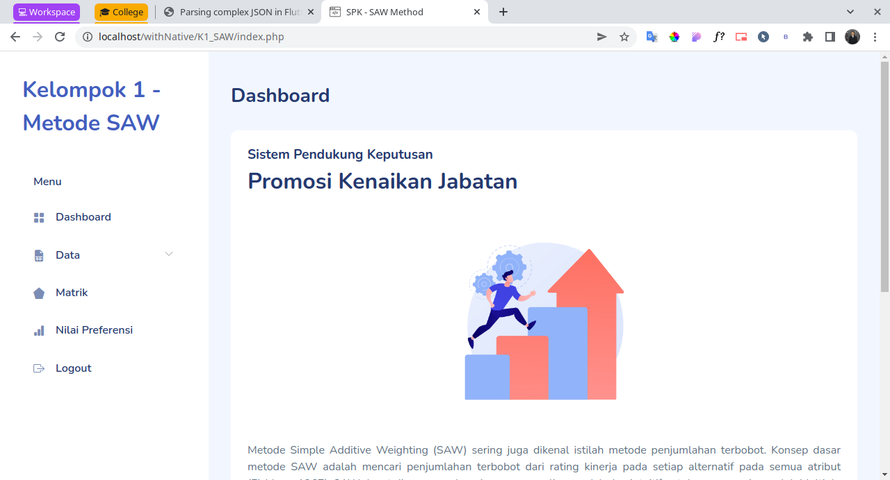
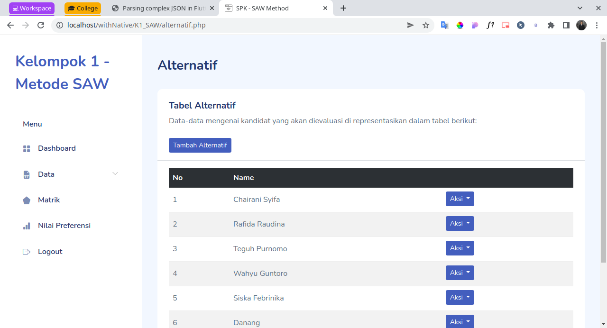
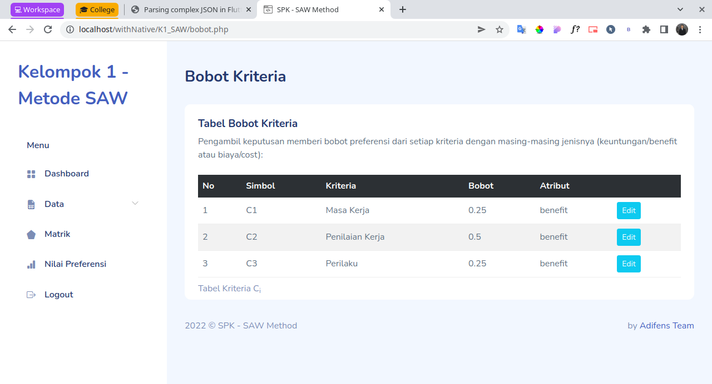
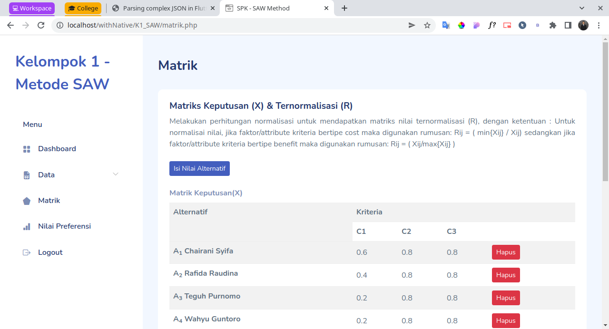
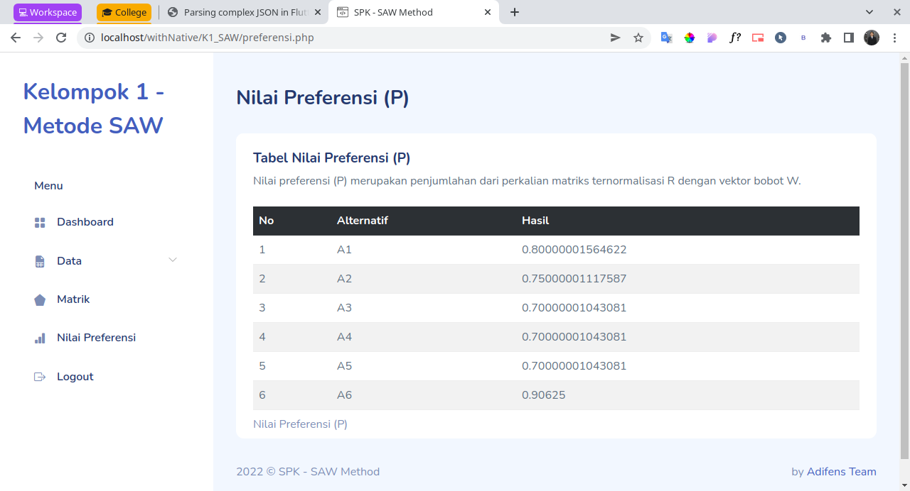

# SPK Menentukan Promosi Kenaikan Jabatan menggunakan metode Simple Additive Weighting

digunakan untuk menentukan kenaikan jabatan menggunakan metode SAW berbasis website

## Log In

## Dashboard

## Alternatif

## Bobot Penilaian

## Matrik

## Nilai Preferensi

